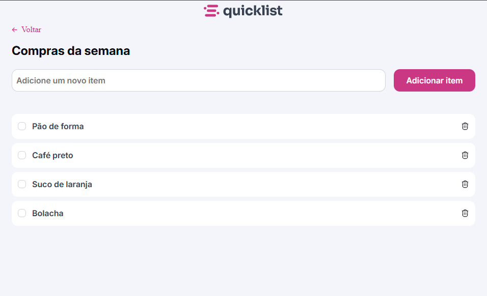

# Quicklist — Shopping List

A simple, fast, and dependency-free shopping list (HTML + CSS + pure JavaScript).
Allows you to add, select, and remove items with a confirmation toast. It features a responsive design.



---

## ✨ Features

- **Add item** via text field + button.
- **Select/unselect** item (custom checkbox).
- **Remove item**
- **Removal alert**
- **Responsive UI**

---

## 🧱 Technologies

- **HTML5** (no build).
- **Modular CSS** with variables and component organization:
- `styles/global.css` (tokens/themes)
- `styles/header.css`, `styles/section.css`, `styles/main.css`
- `styles/fields/*` (inputs, buttons, list, alert)
- **Vanilla JavaScript** to manipulate the list/alert (`script.js`).

---

## 🚀 How to Run

No installations — just static files.

1. Download the ZIP or clone the repository.
2. Open index.html in your browser.
- (Optional) Use VS Code's Live Server for auto-reloading.

---

## 🗂️ Folder structure

```
Shopping-list/
├── assets/
│   ├── logo.png
│   ├── Preview.png
│   └── icons/
│       ├── back.svg
│       ├── checked.svg
│       ├── delete.svg
│       └── trash.svg
├── index.html
├── script.js
└── styles/
    ├── global.css
    ├── header.css
    ├── main.css
    ├── section.css
    └── fields/
        ├── alert.css
        ├── button.css
        ├── index.css
        ├── input.css
        └── item-list.css
```

